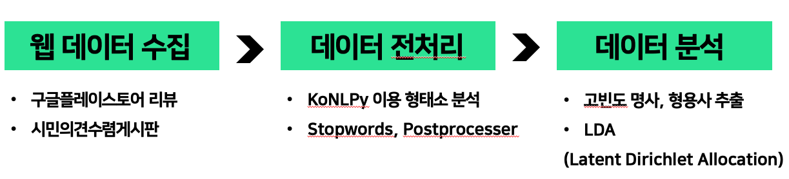
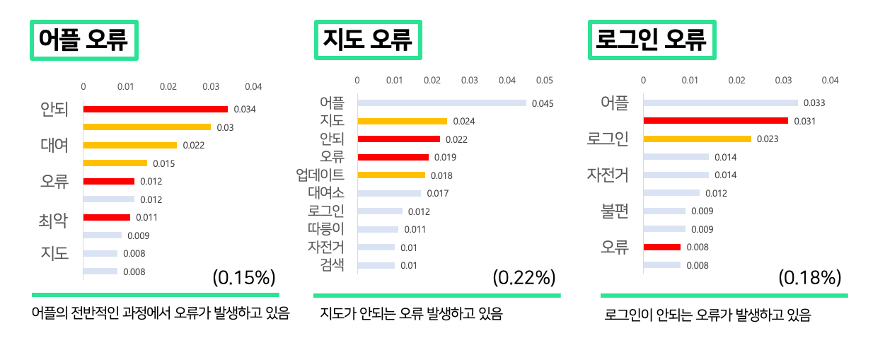
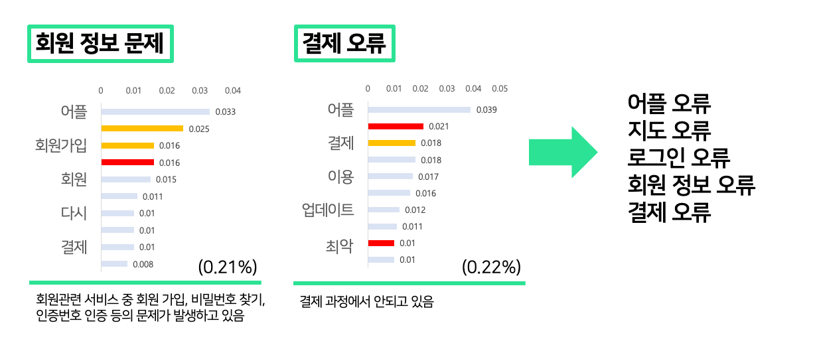
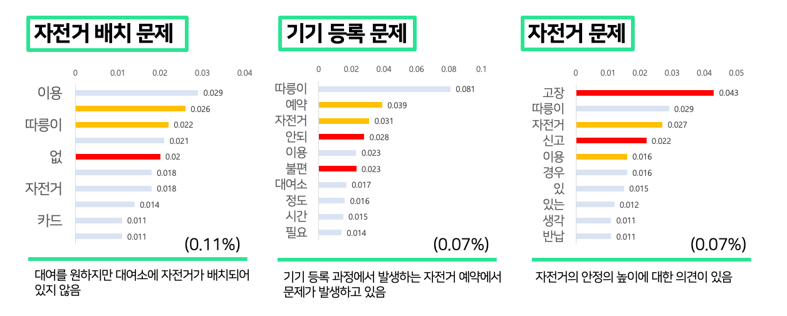
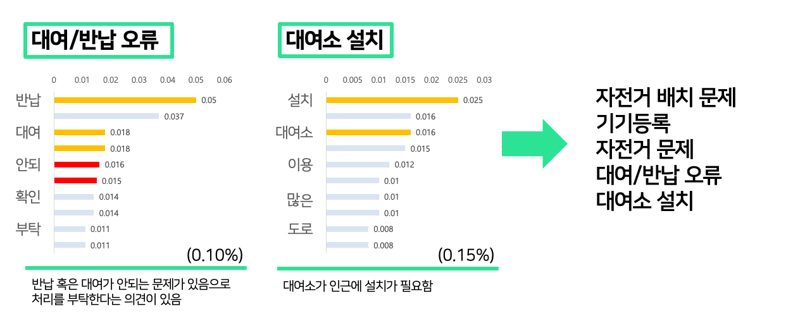
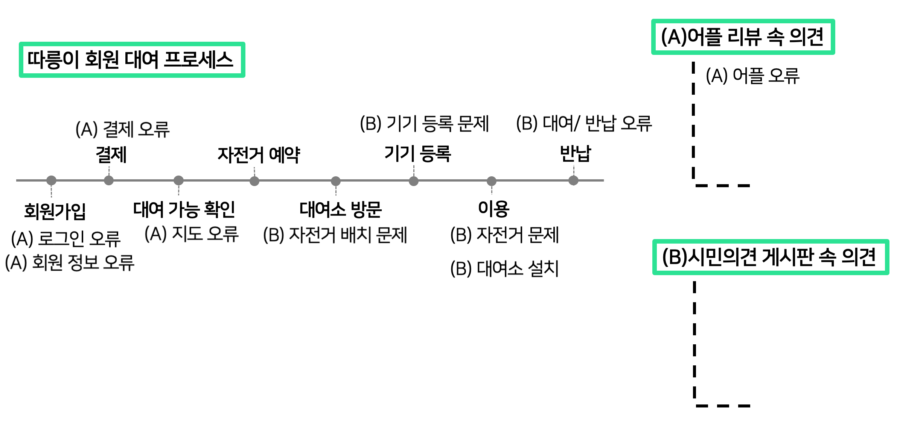
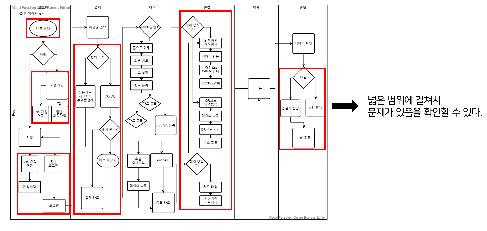

서울시 공유 서비스 따릉이 프로세스 개선
======================

    
    
    
    

<!-- ## Basic Overview -->
> 서울시 공유 자전거 따릉이의 어플리케이션 리뷰와 시민의견수렴 게시판의 게시글을 LDA 토픽 모델링 기법을 사용하여 분석한다. 분석된 결과를 O2O 서비스 기준에 맞추어 오프라인 품질과 온라인 품질로 분류 하여 문제점을 제시 한다.

## 프로젝트 프로세스

## 방법론
#### 토픽 모델링(LDA)를 통한 어플 리뷰 분석
> LDA(Latent Dirichlet Allocation, 잠재 디리클레 할당) 문서 속에 잠재되어 있는 다양한 주제를 추출하는 분석 기법
1. 불용 단어 제거 후, 명사-형용사-동사 추출
2. Document-Term Matrix 제작
3. 추출된 단어를 토필 모델링(LDA)에 적용함
4. 서로 상관관계가 있는 토픽을 뽑아서 분류

## 분석 결과
### 구글 플레이 어플 리뷰

### 시민의견수렴 게시판

### 분석 결론

따릉이 자전거 이용 프로세스 전반적으로 다음과 같은 문제점이 발견되었다.

